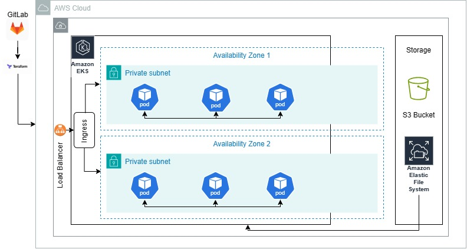

# AWS Infrastructure Deployment README

## Architecture Diagram:

## Git Folder Structure:
1. docker-build-pipeline - Pipeline used to create docker images
2. helm-chart-deployment-pipeline - Pipeline used to deploy helm chart
3. infra-deployment-pipeline - Pipeline used to deploy infra using Terraform
4. images - folder contains architecture diagram and post-deployment screenshots.
5. docs - Word document of the deployment.

Each folder contains a separate README file.

## Components Used:
- GitLab pipeline
- Terraform for Infrastructure as Code
- AWS for infrastructure

## Infrastructure Components:

### Amazon VPC (Virtual Private Cloud):

A custom virtual network environment is created using Amazon VPC to launch AWS resources.

- Subnets, route tables, and internet gateways are configured to provide secure and isolated network access for the deployed services.

### Amazon EKS (Elastic Kubernetes Service):

AWS EKS is utilized as the container orchestration platform for managing containerized applications.

- Kubernetes clusters are deployed to manage the lifecycle of containers, enabling automatic scaling, updates, and self-healing capabilities.

### Amazon ECR (Elastic Container Registry):

Amazon ECR is employed as a fully managed Docker container registry for storing, managing, and deploying Docker container images.

- It provides secure, scalable, and highly available storage for Docker images, ensuring reliable access for containerized applications.

### Amazon EFS (Elastic File System):

Amazon EFS is utilized as a scalable and elastic file storage service for Kubernetes applications.

- It provides shared file storage for multiple Kubernetes pods, enabling data persistence and sharing across the cluster.

## Deployment Process:

### Infrastructure Provisioning:

Terraform is used for infrastructure provisioning, leveraging its declarative configuration files to define the desired state of the infrastructure.

- AWS resources such as VPC, EKS clusters, ECR repositories, and EFS file systems are provisioned using Terraform scripts.

- Terraform state files are stored in an S3 bucket to maintain the state of the infrastructure and enable collaboration among team members.

### Container Orchestration:

Kubernetes manifests and Helm charts are used to define the deployment, services, and other resources required to run containerized applications on AWS EKS.

- Helm charts provide a convenient way to package, version, and deploy Kubernetes applications, simplifying the management of complex application deployments.

### Security Measures:

Security best practices are implemented throughout the deployment process, including the use of private subnets, private EKS clusters, and rootless deployment for enhanced security.

- Role-based access control (RBAC) to control access to resources and restrict communication between pods and services.

### Auto-Scaling:

Horizontal pod autoscaling is configured to automatically adjust the number of pod replicas based on CPU utilization, ensuring optimal resource utilization and performance scalability.

- Auto-scaling enables the infrastructure to dynamically respond to changes in workload demand, ensuring high availability and reliability of the deployed applications.

---

